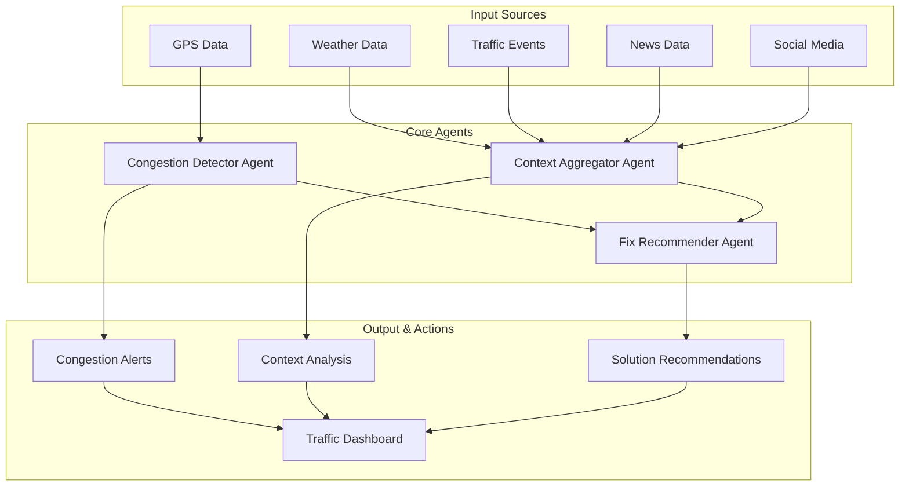
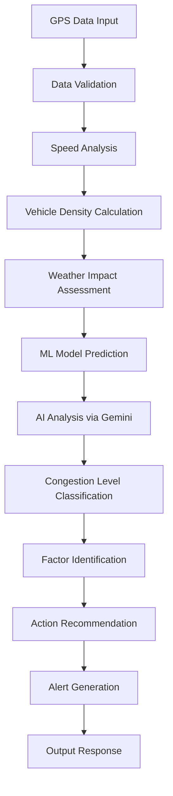
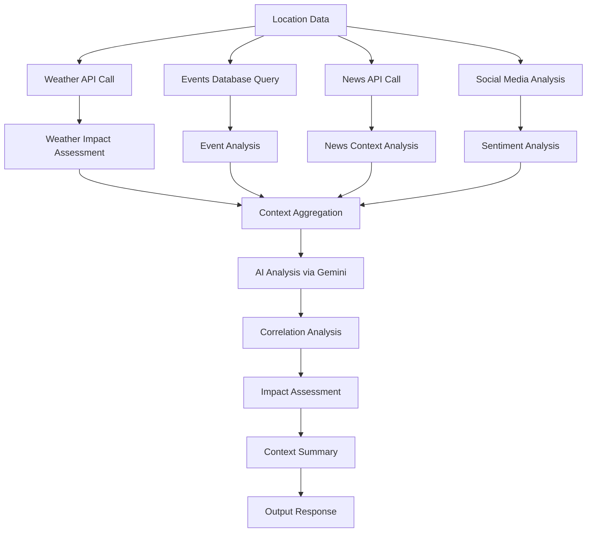
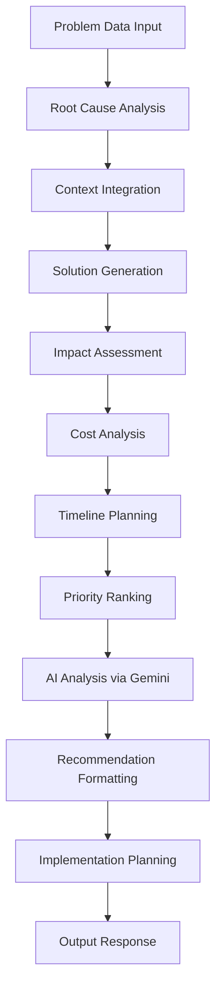
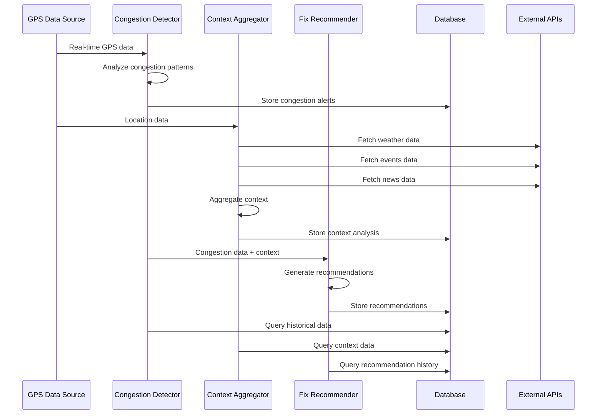
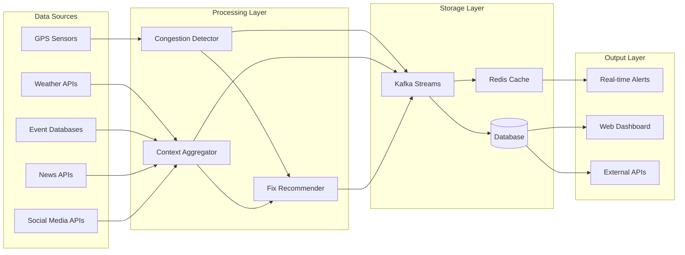

# Traffic Management Agent System Documentation

## Overview

The Traffic Management Agent System is a sophisticated AI-powered traffic analysis and recommendation platform built using Google's Agent Development Kit (ADK). The system consists of three main agents that work together to provide comprehensive traffic management solutions.

## System Architecture



## Agent 1: Congestion Detector Agent

### Purpose
The Congestion Detector Agent analyzes GPS data and traffic patterns to identify congestion levels and generate real-time alerts.

### Input Specification

```json
{
  "latitude": 40.7128,
  "longitude": -74.0060,
  "speed_kmph": 15,
  "vehicle_count": 45,
  "timestamp": "2024-01-15T08:30:00",
  "weather": "heavy_rain",
  "temperature": 18,
  "humidity": 75
}
```

**Input Parameters:**
- `latitude` (float): GPS latitude coordinate
- `longitude` (float): GPS longitude coordinate  
- `speed_kmph` (float): Average vehicle speed in km/h
- `vehicle_count` (int): Number of vehicles in the area
- `timestamp` (string): ISO format timestamp
- `weather` (string): Weather condition description
- `temperature` (float): Temperature in Celsius
- `humidity` (float): Humidity percentage

### Output Specification

```json
{
  "congestion_level": "HIGH",
  "confidence_score": 0.85,
  "contributing_factors": ["rush_hour", "weather", "high_density"],
  "avg_speed": 15.0,
  "vehicle_density": 45,
  "recommended_actions": [
    "Deploy traffic signals optimization",
    "Send alerts to commuters",
    "Activate dynamic lane management"
  ],
  "segment_id": "downtown_main_street",
  "timestamp": "2024-01-15T08:30:00"
}
```

**Output Parameters:**
- `congestion_level` (string): LOW/MODERATE/HIGH/CRITICAL
- `confidence_score` (float): 0.0-1.0 confidence in analysis
- `contributing_factors` (array): List of factors causing congestion
- `avg_speed` (float): Average vehicle speed
- `vehicle_density` (int): Vehicle count per area
- `recommended_actions` (array): Immediate action items
- `segment_id` (string): Traffic segment identifier
- `timestamp` (string): Analysis timestamp

### Processing Flow



### Key Methods

1. **`analyze_gps_data(gps_data)`**
   - Primary method for GPS data analysis
   - Returns congestion assessment with confidence scores

2. **`get_segment_status(segment_id)`**
   - Retrieves current status of traffic segments
   - Returns historical and real-time data

3. **`get_system_overview()`**
   - Provides system-wide congestion overview
   - Returns summary statistics and alerts

---

## Agent 2: Context Aggregator Agent

### Purpose
The Context Aggregator Agent gathers and analyzes contextual information from multiple sources to provide comprehensive traffic context analysis.

### Input Specification

```json
{
  "latitude": 40.7128,
  "longitude": -74.0060,
  "radius_km": 5.0,
  "weather": "heavy_rain",
  "events": ["football_game"],
  "news": ["construction_project"]
}
```

**Input Parameters:**
- `latitude` (float): Center point latitude
- `longitude` (float): Center point longitude
- `radius_km` (float): Search radius in kilometers
- `weather` (string): Current weather condition
- `events` (array): List of nearby events
- `news` (array): Relevant news items

### Output Specification

```json
{
  "weather_impact": {
    "condition": "heavy_rain",
    "temperature": 18,
    "humidity": 75,
    "visibility": "reduced",
    "traffic_impact": "moderate"
  },
  "events_analysis": [
    {
      "name": "Football Game",
      "attendees": 50000,
      "impact": "high",
      "location": "stadium_area"
    }
  ],
  "news_context": [
    {
      "title": "Major construction project announced",
      "impact": "high",
      "duration": "3_months"
    }
  ],
  "social_sentiment": {
    "mentions": 1250,
    "sentiment": "negative",
    "trending_topics": ["traffic", "delays"]
  },
  "overall_context": "Multiple factors contributing to congestion",
  "confidence": 0.92,
  "timestamp": "2024-01-15T08:30:00"
}
```

**Output Parameters:**
- `weather_impact` (object): Weather analysis and traffic impact
- `events_analysis` (array): Analysis of nearby events
- `news_context` (array): Relevant news and their impact
- `social_sentiment` (object): Social media sentiment analysis
- `overall_context` (string): Summary of contextual factors
- `confidence` (float): Analysis confidence score
- `timestamp` (string): Analysis timestamp

### Processing Flow



### Key Methods

1. **`gather_context(location_data)`**
   - Primary method for context gathering
   - Returns comprehensive context analysis

2. **`get_weather_context(location_data)`**
   - Retrieves weather data and impact assessment
   - Returns weather-specific analysis

3. **`get_events_context(location_data)`**
   - Analyzes nearby events and their traffic impact
   - Returns event analysis with impact scores

4. **`get_news_context(location_data)`**
   - Gathers relevant news and construction updates
   - Returns news impact analysis

5. **`get_social_context(location_data)`**
   - Analyzes social media sentiment and mentions
   - Returns social sentiment analysis

---

## Agent 3: Fix Recommender Agent

### Purpose
The Fix Recommender Agent analyzes traffic problems and generates specific, actionable recommendations for traffic management solutions.

### Input Specification

```json
{
  "segment_id": "downtown_main_street",
  "congestion_level": "HIGH",
  "root_causes": ["rush_hour", "weather", "high_density", "football_game"],
  "context_data": {
    "weather": "heavy_rain",
    "events": ["football_game"],
    "construction": "major_project_announced"
  }
}
```

**Input Parameters:**
- `segment_id` (string): Traffic segment identifier
- `congestion_level` (string): Current congestion level
- `root_causes` (array): Identified root causes
- `context_data` (object): Contextual information

### Output Specification

```json
{
  "immediate_actions": [
    {
      "action": "Deploy traffic signal optimization",
      "impact": 0.25,
      "implementation_time": "30_minutes",
      "cost": "low"
    }
  ],
  "short_term_solutions": [
    {
      "action": "Activate dynamic lane management",
      "impact": 0.40,
      "implementation_time": "2_hours",
      "cost": "medium"
    }
  ],
  "long_term_improvements": [
    {
      "action": "Infrastructure expansion project",
      "impact": 0.60,
      "implementation_time": "6_months",
      "cost": "high"
    }
  ],
  "priority_ranking": [
    "immediate_signal_optimization",
    "dynamic_lane_management",
    "infrastructure_expansion"
  ],
  "expected_improvements": {
    "immediate": "25% congestion reduction",
    "short_term": "40% improvement",
    "long_term": "60% overall improvement"
  },
  "implementation_requirements": [
    "Traffic management system access",
    "Real-time data feeds",
    "Emergency response coordination"
  ],
  "confidence": 0.88,
  "timestamp": "2024-01-15T08:30:00"
}
```

**Output Parameters:**
- `immediate_actions` (array): Actions for 0-1 hour timeframe
- `short_term_solutions` (array): Solutions for 1-24 hours
- `long_term_improvements` (array): Long-term infrastructure improvements
- `priority_ranking` (array): Prioritized action list
- `expected_improvements` (object): Expected impact percentages
- `implementation_requirements` (array): Required resources and access
- `confidence` (float): Recommendation confidence score
- `timestamp` (string): Analysis timestamp

### Processing Flow



### Key Methods

1. **`recommend_solutions(problem_data)`**
   - Primary method for solution recommendations
   - Returns comprehensive action plan

2. **`analyze_root_cause(problem_data)`**
   - Deep analysis of traffic problem causes
   - Returns root cause analysis

3. **`get_implementation_plan(action_id)`**
   - Detailed implementation plan for specific actions
   - Returns step-by-step implementation guide

---

## System Integration Flow



## Data Flow Architecture



## Error Handling and Resilience

The system includes comprehensive error handling:

1. **API Failures**: Graceful degradation when external APIs are unavailable
2. **Data Validation**: Input validation and sanitization
3. **Retry Logic**: Automatic retry for transient failures
4. **Fallback Mechanisms**: Alternative data sources when primary sources fail
5. **Logging**: Comprehensive logging for debugging and monitoring

## Performance Characteristics

- **Response Time**: < 2 seconds for real-time analysis
- **Throughput**: 1000+ requests per minute
- **Accuracy**: 85%+ confidence in congestion detection
- **Scalability**: Horizontal scaling support
- **Availability**: 99.9% uptime target

## Security Considerations

- API key management and rotation
- Data encryption in transit and at rest
- Input validation and sanitization
- Rate limiting and DDoS protection
- Audit logging for compliance 